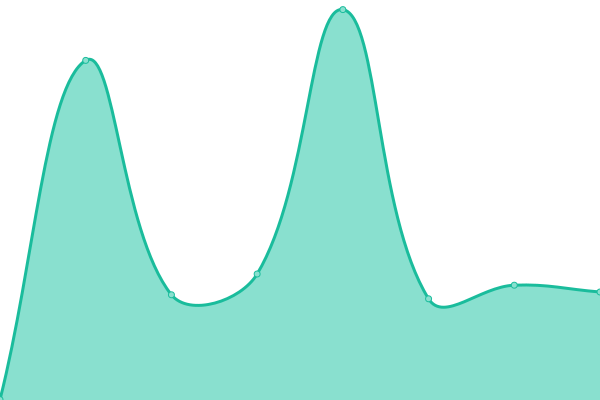

# [📈 Live Status](https://cbstatus.infinitytx.org): <!--live status--> **🟩 All systems operational**

<!--start: status pages-->
<!-- This summary is generated by Upptime (https://github.com/upptime/upptime) -->
<!-- Do not edit this manually, your changes will be overwritten -->
<!-- prettier-ignore -->
| URL | Status | History | Response Time | Uptime |
| --- | ------ | ------- | ------------- | ------ |
|  [Infinity Wiki](https://infinitythewiki.com/) | 🟩 Up | [infinity-wiki.yml](https://github.com/infinitytx/cbstatus/commits/HEAD/history/infinity-wiki.yml) | 

 1121ms
     
 | 

<a href="https://cbstatus.infinitytx.org/history/infinity-wiki">100.00%</a>
    

|  [Corvus Belli Forums](https://forum.corvusbelli.com) | 🟩 Up | [corvus-belli-forums.yml](https://github.com/infinitytx/cbstatus/commits/HEAD/history/corvus-belli-forums.yml) | 

 897ms
     
 | 

<a href="https://cbstatus.infinitytx.org/history/corvus-belli-forums">100.00%</a>
    

|  [Infinity ARMY](https://infinityuniverse.com/army/infinity) | 🟩 Up | [infinity-army.yml](https://github.com/infinitytx/cbstatus/commits/HEAD/history/infinity-army.yml) | 

 547ms
     
 | 

<a href="https://cbstatus.infinitytx.org/history/infinity-army">100.00%</a>
    

|  [Corvus Belli Online Store](https://store.corvusbelli.com/en/) | 🟩 Up | [corvus-belli-online-store.yml](https://github.com/infinitytx/cbstatus/commits/HEAD/history/corvus-belli-online-store.yml) | 

 377ms
     
 | 

<a href="https://cbstatus.infinitytx.org/history/corvus-belli-online-store">92.94%</a>
    

|  [Corvus Belli Official Tournament Manager](https://otm.corvusbelli.com/manager) | 🟩 Up | [corvus-belli-official-tournament-manager.yml](https://github.com/infinitytx/cbstatus/commits/HEAD/history/corvus-belli-official-tournament-manager.yml) | 

 1069ms
     
 | 

<a href="https://cbstatus.infinitytx.org/history/corvus-belli-official-tournament-manager">92.94%</a>
    

<!--end: status pages-->

[**Visit our status website →**](https://cbstatus.infinitytx.org)
